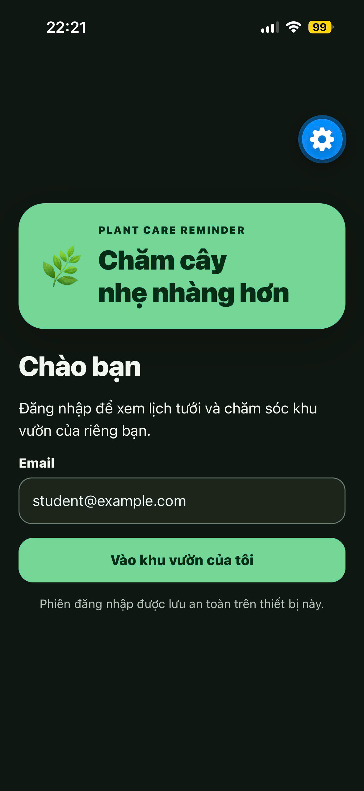
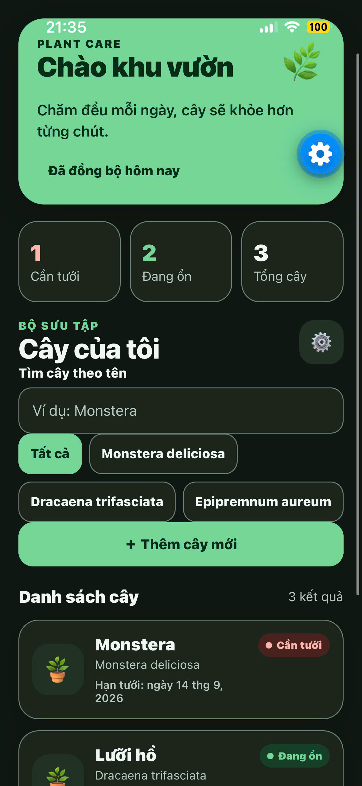
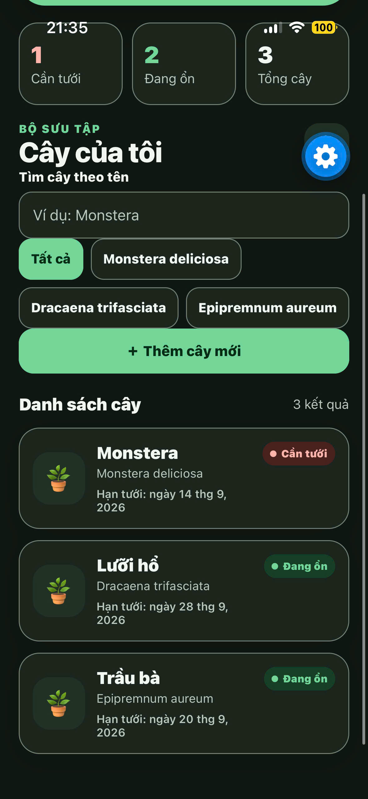
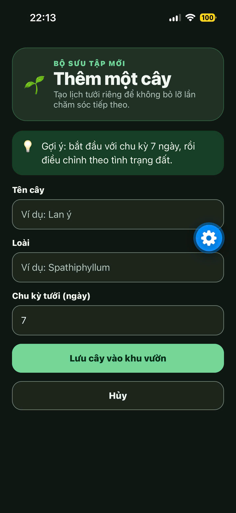
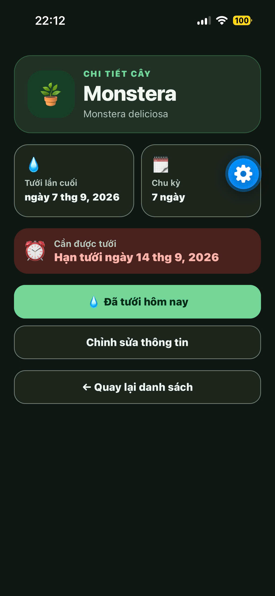
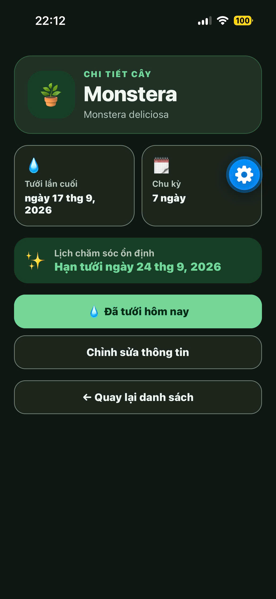
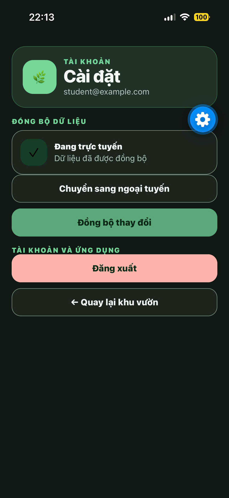

# Plant Care Reminder

Ứng dụng Expo/React Native hỗ trợ người dùng theo dõi lịch tưới cây trong nhà.

## Chức năng đã triển khai

- Đăng nhập/đăng xuất: phiên được lưu bằng `expo-secure-store`; khi khởi động lại, ứng dụng đọc lại phiên. Đăng xuất xóa phiên bằng `deleteItemAsync`.
- Danh sách cây từ mock API bất đồng bộ qua TanStack Query; có tìm theo tên, lọc theo loài, màn hình trống và nút thử lại khi lỗi.
- Thêm cây, chỉnh sửa cây, màn hình chi tiết động `plant/[id]`, và nút “Đã tưới hôm nay”. Hạn tưới và số cây quá hạn luôn tính từ `lastWatered` + `wateringDays`, không lưu thành một trường dữ liệu.
- Chế độ ngoại tuyến mô phỏng trong Cài đặt: danh sách tải thành công gần nhất được giữ trong AsyncStorage và hiển thị banner. Thay đổi khi ngoại tuyến được ghi vào hàng đợi bền vững, hiển thị số lượng chờ, và chỉ bị xóa sau khi đồng bộ thành công.
- Light/dark scheme dùng duy nhất `src/lib/tokens.ts`; các file khác không chứa mã màu hex. Điều khiển có `accessibilityRole`/`accessibilityLabel` và chiều cao tối thiểu 44.

## Ảnh chụp màn hình ứng dụng

Các ảnh dưới đây được chụp từ bản chạy thực tế trên thiết bị di động.

| Đăng nhập | Trang chủ - tổng quan |
| --- | --- |
|  |  |

| Trang chủ - danh sách cây | Thêm cây mới |
| --- | --- |
|  |  |

| Cây cần tưới | Cây đã tưới |
| --- | --- |
|  |  |

| Cài đặt và đồng bộ dữ liệu |
| --- |
|  |

## Cấu trúc và kế hoạch đã thực hiện

1. Cấu hình Expo SDK 57, TypeScript strict và Expo Router.
2. Tạo mô hình `Plant`, `CareLog`, mock API và kiểm thử hàm ngày tháng.
3. Tạo Zustand store có selectors cho phiên, kết nối, cache và hàng đợi offline; TanStack Query quản lý truy vấn/mutation dữ liệu cây.
4. Hoàn thành các route: `login`, `/`, `plant/new`, `plant/[id]`, `settings`.
5. Rà soát các trạng thái tải/lỗi/trống/nội dung ở các màn hình dùng dữ liệu và trạng thái gửi biểu mẫu; bổ sung retry cho truy vấn/đồng bộ.
6. Cài dependencies, chạy typecheck, lint, test và export web trước khi nộp.

## Chạy từ máy sạch

Yêu cầu Node.js LTS và npm.

```powershell
npm install
npm run start
```

Sau đó quét QR bằng Expo Go, hoặc dùng `npm run android`, `npm run ios`, hay `npm run web` nếu môi trường đã có emulator/trình duyệt tương ứng.

## Kiểm tra chất lượng

```powershell
npm run typecheck
npm run lint
npm test
```

Kiểm thử tự động hiện có kiểm tra công thức tính hạn tưới/quá hạn tại `tests/dates.test.ts`.

Kết quả xác minh cục bộ:

- `npx expo export --platform web`: thành công, tạo thư mục `dist`.
- `npm run typecheck`: thành công.
- `npm run lint`: thành công.
- `npm test`: 1/1 kiểm thử thành công.
- `npx expo install --check`: dependencies khớp Expo SDK 57.

## Cập nhật UI UX hiện đại

- Dashboard mới có hero card, thống kê cây cần tưới/đang ổn/tổng số cây, chip lọc, tìm kiếm và thẻ cây có trạng thái deadline.
- Các màn hình đăng nhập, thêm cây, chi tiết cây và cài đặt dùng cùng visual language: thẻ bo góc, hierarchy rõ, trạng thái offline/đồng bộ dễ nhận biết và phản hồi nhấn nút.
- Hiệu ứng `Animated` native tạo fade/translate entrance cho dashboard, card và form; nút có phản hồi scale khi nhấn. Hook `useReducedMotion` tắt motion khi thiết bị bật Reduce Motion.
- Màu mới vẫn chỉ khai báo tại `src/lib/tokens.ts`; không có mã hex màu tại component/screen.

### Kiểm tra UI thủ công sau cập nhật

1. Chạy `npm start`, quét QR bằng Expo Go SDK 57 rồi đăng nhập.
2. Kiểm tra hero dashboard, thẻ thống kê, filter chip, hiệu ứng xuất hiện và phản hồi nhấn nút.
3. Mở một cây, thử tưới/chỉnh sửa; sau đó thêm cây và vào Cài đặt để kiểm tra offline/sync.
4. Bật Reduce Motion trong cài đặt accessibility của thiết bị để xác nhận animation không còn chạy.

## Hướng dẫn kiểm thử thủ công

1. Đăng nhập bằng email hợp lệ, tắt và mở lại ứng dụng để kiểm tra session còn tồn tại.
2. Vào Cài đặt, bấm Đăng xuất, mở lại ứng dụng để xác nhận phải đăng nhập lại.
3. Ở danh sách, tìm “Monstera”, thử lọc theo loài, mở một cây, bấm “Đã tưới hôm nay” và quan sát hạn tưới đổi ngay.
4. Vào Cài đặt, chuyển sang ngoại tuyến, sửa hoặc thêm cây. Banner và số thay đổi chờ phải xuất hiện. Chuyển trực tuyến, bấm Đồng bộ thay đổi để xóa hàng đợi.
5. Đổi light/dark scheme của thiết bị để rà soát độ đọc được và thử VoiceOver/TalkBack với các nhãn điều khiển.

## Sửa bố cục màn hình đăng nhập

Khẩu hiệu của hero đăng nhập không còn dùng `adjustsFontSizeToFit` hoặc giới hạn hai dòng. Hai thuộc tính này đã khiến React Native thu nhỏ chữ quá mức trên thiết bị thực. Khẩu hiệu hiện có cỡ chữ responsive, line-height cố định và vùng `brandCopy` co giãn đúng; thẻ có thể nở theo nội dung để giữ khả năng đọc khi màn hình hẹp hoặc cỡ chữ hệ thống lớn.
